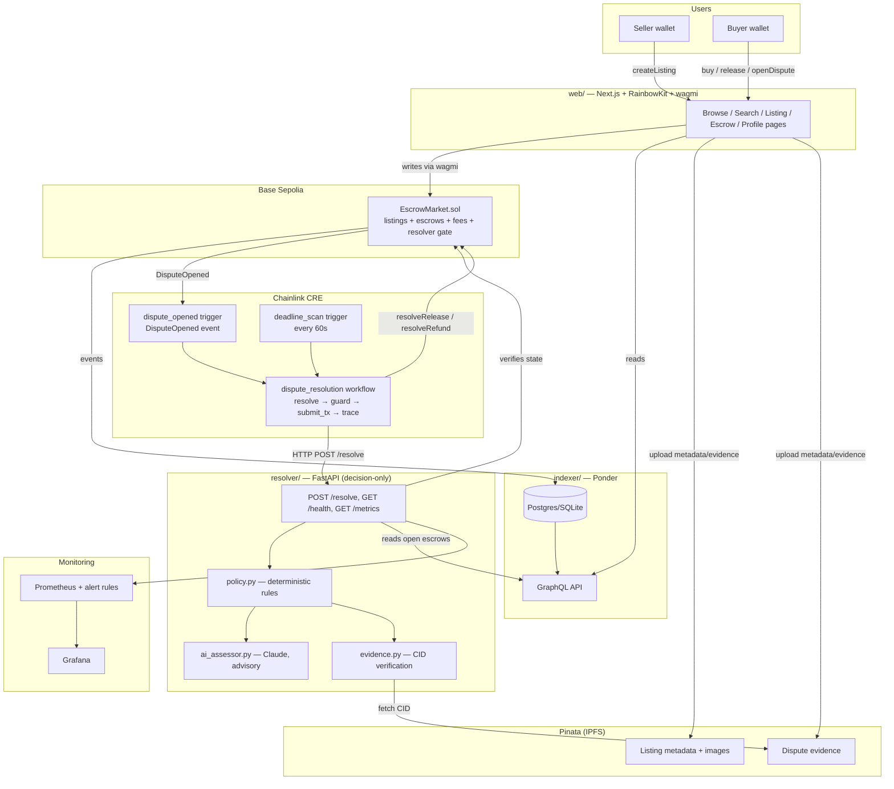

# PLAN.md — Base Escrow → Onchain Marketplace ("onchain eBay" on Base)

> **Status:** DRAFT — awaiting explicit approval before any implementation begins.
> **Date:** 2026-06-11
> **Scope:** Transform the single-escrow hackathon MVP into a production-grade, multi-escrow marketplace on Base with listings, search, reviews/rankings, and automated CRE-driven dispute resolution.

---

## 0. Approved Decisions (from Q&A)

| # | Question | Decision |
|---|---|---|
| a | Contract language | **Rewrite in Solidity** (Foundry toolchain, OpenZeppelin) |
| b | Multi-escrow pattern | **Monolithic mapping-based contract** (escrows keyed by `escrowId`) |
| c | P0 marketplace features | **Listings + categories + search**. Ratings/reviews, seller profiles, fee admin UI = P1; advanced admin = P2 |
| d | Dispute resolution | **Off-chain resolver + CRE**; contract only enforces *who* may resolve |
| e | Frontend | **Next.js (App Router)** |
| f | Wallet | **RainbowKit + wagmi/viem** |
| g | Indexer | **Ponder** |
| h | Tokens | **ETH + whitelisted ERC-20 (USDC first)** |
| i | Deployment | **Base Sepolia only**; mainnet deferred until audited |
| j | Testing | **Foundry** (unit + fuzz + invariant), pytest for resolver |
| k | CI/CD | **GitHub Actions**: lint + build + unit tests + deploy previews (Vercel); security static analysis deferred to nightly/P2 |
| l | Evidence/media storage | **IPFS via Pinata** (CIDs as content commitments) |
| m | Design assets | None — **Tailwind + shadcn/ui**, clean neutral default |
| n | Fee model | **Protocol-wide percentage (bps)** with hard cap in contract; fee plumbing built in P0, set to 0 until P1 |
| o | Reputation | **Off-chain indexed**: reviews as on-chain events → Ponder aggregates scores/rankings |
| + | AI assessor | **Keep advisory**, expand inputs (evidence, deadlines, history); never overrides policy |
| + | Anti-dispute-abuse | **Deadlines + evidence policy** (auto-release timeout, evidence-gated refund); no bonds in MVP |
| + | Repo layout | **Monorepo**: `contracts/` (Foundry), `resolver/`, `indexer/`, `web/`, `cre/` |
| + | Hackathon state | **Tag `hackathon-submission`**, archive evidence docs, evolve `main` freely |

---

## 1. Architecture Diagram



**Key flow changes vs MVP:**
- One contract handles *all* listings and escrows (no per-deal deploys).
- Funding is atomic with purchase: `buy(listingId)` creates **and funds** the escrow in one tx (the `AWAITING_DEPOSIT` limbo state disappears).
- **CRE owns transaction submission** — the resolver is a pure decision service (resolves §10 issue 7).
- The resolver discovers open escrows via the Ponder GraphQL API, then **re-verifies state on-chain via RPC** before deciding (indexer is a hint, chain is truth).

---

## 2. Contract Architecture

### 2.1 Contracts & interfaces

```
contracts/src/
├── EscrowMarket.sol          # The marketplace: listings + escrows + resolution
├── interfaces/
│   ├── IEscrowMarket.sol     # Full external interface (consumed by web/indexer/resolver tooling)
│   └── IReviewRegistry.sol   # P1
├── ReviewRegistry.sol        # P1 — event-only reviews gated by completed escrows
└── libraries/
    └── Errors.sol            # Custom errors (gas + clarity)
```

Inheritance (OpenZeppelin v5):

```
EscrowMarket
├── Ownable2Step          # admin: fees, resolver address, token whitelist, pause
├── Pausable              # pause blocks NEW listings/purchases only — never blocks release/refund/withdraw
└── ReentrancyGuard       # all fund-moving functions
```

### 2.2 Core data structures

```solidity
enum EscrowStatus { None, Funded, Disputed, Released, Refunded }

struct Listing {
    address seller;
    address token;        // address(0) = native ETH
    uint96  price;
    bytes32 category;     // keccak of category slug; canonical list enforced off-chain
    string  metadataCID;  // IPFS: title, description, images
    bool    active;
}

struct Escrow {
    uint256 listingId;
    address buyer;
    address seller;
    address token;
    uint96  amount;               // price snapshot at purchase
    uint96  feeAmount;            // snapshot of fee at purchase (bps applied)
    EscrowStatus status;
    uint64  releaseDeadline;      // created + releaseWindow
    uint64  sellerResponseDeadline; // set when dispute opens
    string  evidenceCID;          // latest evidence commitment (IPFS CID)
    address disputedBy;
}
```

State: `mapping(uint256 => Listing) listings`, `mapping(uint256 => Escrow) escrows`, monotonic `nextListingId` / `nextEscrowId`, `mapping(address => bool) allowedTokens`, `mapping(address => mapping(address => uint256)) withdrawable` (pull-payment fallback), `address resolver`, `uint16 feeBps` (hard-capped: `MAX_FEE_BPS = 500`), `uint64 releaseWindow`, `uint64 sellerResponseWindow`, `address treasury`.

### 2.3 State machine (per escrow)

```
            buy(listingId) [payable / ERC-20]
                      │  (atomic create + fund)
                      ▼
                   FUNDED ──────────── release() by buyer ───────────────▶ RELEASED
                      │                resolveRelease() by resolver          (terminal)
                      │                  (AUTO_RELEASE_TIMEOUT after
                      │                   releaseDeadline)
                      │
        openDispute(evidenceCID)
        by buyer or seller, only
        BEFORE releaseDeadline
                      │
                      ▼
                  DISPUTED ─────────── resolveRelease(reasonCode) ────────▶ RELEASED
                      │                by resolver                           (terminal)
                      │
                      └─────────────── resolveRefund(reasonCode) ─────────▶ REFUNDED
                                       by resolver (evidence-gated            (terminal)
                                       policy off-chain)
```

Notes:
- `release()` also callable by buyer in `Disputed` (buyer can always concede to seller).
- `submitEvidence(escrowId, cid)` callable by either party while `Disputed` (updates `evidenceCID`, emits event — full evidence history lives in events/indexer).
- Listings have their own lifecycle: `createListing → updateListing/cancelListing` (price changes never affect existing escrows — amount is snapshotted at `buy`).

### 2.4 External functions

| Function | Caller | Guards |
|---|---|---|
| `createListing(token, price, category, metadataCID)` | any | `whenNotPaused`, token whitelisted |
| `updateListing(id, price, metadataCID)` / `cancelListing(id)` | listing seller | — |
| `buy(listingId)` payable / `buyERC20(listingId)` | any except seller | `whenNotPaused`, `nonReentrant`, exact value/`safeTransferFrom` |
| `release(escrowId)` | buyer | `Funded` or `Disputed`, `nonReentrant` |
| `openDispute(escrowId, evidenceCID)` | buyer or seller | `Funded`, `block.timestamp < releaseDeadline` |
| `submitEvidence(escrowId, cid)` | buyer or seller | `Disputed` |
| `resolveRelease(escrowId, reasonCode)` | resolver only | `Funded && past deadline` **or** `Disputed`, `nonReentrant` |
| `resolveRefund(escrowId, reasonCode)` | resolver only | `Disputed`, `nonReentrant` |
| `withdraw(token)` | anyone with balance | pull-payment fallback |
| Admin: `setFeeBps` (≤ cap), `setTreasury`, `setResolver`, `setToken(token, allowed)`, `setWindows`, `pause/unpause` | owner | `Ownable2Step` |

### 2.5 Events (designed for Ponder + CRE)

```solidity
event ListingCreated(uint256 indexed listingId, address indexed seller, address token, uint96 price, bytes32 indexed category, string metadataCID);
event ListingUpdated(uint256 indexed listingId, uint96 price, string metadataCID);
event ListingCancelled(uint256 indexed listingId);
event EscrowCreated(uint256 indexed escrowId, uint256 indexed listingId, address indexed buyer, address seller, address token, uint96 amount, uint64 releaseDeadline);
event Released(uint256 indexed escrowId, address indexed by, uint96 amount, uint96 fee);
event Refunded(uint256 indexed escrowId, address indexed by, uint96 amount);
event DisputeOpened(uint256 indexed escrowId, address indexed by, string evidenceCID, uint64 sellerResponseDeadline);   // ← name/field CRE expects (§10 #2)
event EvidenceSubmitted(uint256 indexed escrowId, address indexed by, string cid);
event Resolved(uint256 indexed escrowId, uint8 action, bytes32 reasonCode);   // resolver audit trail on-chain
event WithdrawalQueued(address indexed to, address token, uint256 amount);
event FeeUpdated(uint16 bps); event ResolverUpdated(address resolver); event TokenAllowed(address token, bool allowed);
// P1 (ReviewRegistry):
event ReviewSubmitted(uint256 indexed escrowId, address indexed reviewer, address indexed subject, uint8 rating, string commentCID);
```

### 2.6 Funds handling (resolves §10 #6)

- Payouts use `SafeERC20.safeTransfer` / native `call{value:}` under `nonReentrant`, checks-effects-interactions strictly maintained.
- If a **native** transfer fails (contract recipient reverting/gas-griefing), the amount is credited to `withdrawable[recipient][address(0)]` and `WithdrawalQueued` is emitted — escrow still reaches its terminal state. Funds can never be stuck by an uncooperative recipient.
- Fee (`feeAmount`, snapshotted at purchase) goes to `treasury` on `Released` only (refunds return the full amount incl. fee to the buyer).

---

## 3. Module Breakdown (monorepo)

```
base-escrow/
├── contracts/                      # Foundry project (replaces Vyper)
│   ├── foundry.toml
│   ├── src/  (see §2.1)
│   ├── test/
│   │   ├── EscrowMarket.t.sol      # unit tests per function/transition
│   │   ├── EscrowMarket.fuzz.t.sol # fuzz: amounts, timestamps, actors
│   │   ├── Invariants.t.sol        # invariant suite (see §7)
│   │   └── handlers/MarketHandler.sol
│   └── script/
│       ├── Deploy.s.sol            # deploy + config (windows, treasury, resolver)
│       └── SeedListings.s.sol      # demo data for Sepolia
├── resolver/                       # Python FastAPI — DECISION ONLY
│   ├── src/
│   │   ├── api.py                  # POST /resolve, GET /health, GET /metrics
│   │   ├── policy.py               # restored deadline/evidence rule engine (§5 of Tech Summary)
│   │   ├── chain_client.py         # multi-escrow reads: Ponder GraphQL discovery + on-chain RPC verification. NO tx submission in service path (§10 #7)
│   │   ├── indexer_client.py       # NEW — GraphQL queries against Ponder
│   │   ├── evidence.py             # CID-based verification (fetch from IPFS gateway, verify CID matches content)
│   │   ├── ai_assessor.py          # expanded inputs: evidence content, deadlines, dispute history; still advisory-only
│   │   ├── config.py, types.py     # extended: EscrowState gains token/amount/deadlines from chain
│   │   └── main.py                 # dev-only harness; direct submission gated by RESOLVER_SUBMIT_ENABLED=false default
│   ├── tests/                      # NEW — pytest: policy table-driven tests, evidence, api auth
│   └── requirements.txt            # + pytest, ruff, httpx, prometheus-fastapi-instrumentator
├── indexer/                        # NEW — Ponder
│   ├── ponder.config.ts            # chain: baseSepolia, contract: EscrowMarket
│   ├── ponder.schema.ts            # listings, escrows, disputes, evidence, reviews, sellerStats
│   └── src/index.ts                # event handlers; sellerStats aggregation (completed trades, avg rating P1, dispute rate)
├── web/                            # NEW — Next.js App Router
│   ├── app/
│   │   ├── page.tsx                # browse + category filter + search
│   │   ├── listing/[id]/page.tsx   # listing detail + buy
│   │   ├── sell/page.tsx           # create listing (Pinata upload)
│   │   ├── escrow/[id]/page.tsx    # escrow detail: release / dispute / evidence
│   │   ├── me/page.tsx             # my purchases & sales
│   │   └── seller/[addr]/page.tsx  # P1 — profile, stats, reviews
│   ├── lib/ (wagmi config, contract ABIs, GraphQL client, pinata client)
│   └── components/ (shadcn/ui based)
├── cre/
│   ├── triggers/
│   │   ├── dispute_opened.trigger.yaml   # event: DisputeOpened(escrowId) — aligned (§10 #2)
│   │   └── deadline_scan.trigger.yaml    # unchanged 60s scan
│   └── workflows/
│       └── dispute_resolution.workflow.yaml  # resolver returns {method, args}; submit_tx uses them verbatim (§10 #3)
├── ops/
│   ├── prometheus.yml
│   └── alerts/escrow_alerts.yml    # NEW — alert rules (§10 #9)
├── docs/
│   ├── archive/hackathon/          # moved: README_test_evidence.md, HOW_TO_REPRODUCE.md, Technical Summary
│   └── ARCHITECTURE.md             # living doc replacing the Technical Summary
├── .github/workflows/              # NEW — ci.yml, deploy-preview via Vercel, testnet-deploy (manual)
├── PLAN.md                         # this file
└── README.md                       # rewritten for marketplace
```

**Resolver `/resolve` response contract (new, fixes §10 #3):**

```json
{
  "escrow_id": "42",
  "action": "REFUND",
  "method": "resolveRefund",
  "args": { "escrowId": "42", "reasonCode": "0x53454c4c..." },
  "reason_code": "SELLER_INACTIVE_VALID_EVIDENCE",
  "should_submit_tx": true,
  "ai_assessment": { "classification": "...", "policy_alignment": "confirmed", "rationale": "..." }
}
```

The CRE workflow's `submit_tx` step consumes `method` + `args` directly — no uppercase/lowercase mapping, no missing-arg mismatch.

**Restored policy engine (per original design, now backed by on-chain fields):**

| Rule | Condition | Decision | Reason code | Submit? |
|---|---|---|---|---|
| Auto-release | `Funded` && `now > releaseDeadline` | RELEASE | `AUTO_RELEASE_TIMEOUT` | ✅ |
| Missing evidence | `Disputed` && no evidenceCID | HOLD | `MISSING_EVIDENCE` | ❌ |
| Evidence invalid | `Disputed` && CID unfetchable/mismatched | HOLD | `EVIDENCE_HASH_MISMATCH` | ❌ |
| Seller inactive | `Disputed` && valid evidence && `now > sellerResponseDeadline` | REFUND | `SELLER_INACTIVE_VALID_EVIDENCE` | ✅ |
| Default | — | NONE | `NO_ACTION` | ❌ |

---

## 4. Dependencies

**Contracts (Foundry):** `forge-std`, `openzeppelin-contracts` (v5: Ownable2Step, Pausable, ReentrancyGuard, SafeERC20).

**Indexer (npm):** `ponder`, `viem`, `typescript`.

**Web (npm):** `next` (App Router), `react`, `wagmi`, `viem`, `@rainbow-me/rainbowkit`, `@tanstack/react-query`, `graphql-request`, `tailwindcss`, `shadcn/ui` (radix + cva), `pinata` SDK, `zod`.

**Resolver (pip):** existing (`fastapi`, `uvicorn`, `web3`, `python-dotenv`, `anthropic`, `requests`, `pyyaml`) + `pytest`, `httpx`, `ruff`, `gql` (GraphQL client), `prometheus-fastapi-instrumentator`.

**External services:** Base Sepolia RPC (public + fallback provider), Pinata (IPFS pin + gateway), Vercel (web hosting + previews), Chainlink CRE, Anthropic API (advisory assessor), GitHub Actions, Prometheus/Grafana (existing host).

**Sepolia constants:** USDC (Base Sepolia) `0x036CbD53842c5426634e7929541eC2318f3dCF7e` — verify against Circle docs at implementation time.

---

## 5. Migration Path (single-escrow MVP → marketplace)

1. **Preserve the hackathon submission:** `git tag hackathon-submission` on current `main`; move `README_test_evidence.md`, `HOW_TO_REPRODUCE.md`, and the Technical Summary to `docs/archive/hackathon/` (links updated). Loom/tx evidence remains intact at the tag.
2. **Old deployments:** all listed Sepolia instances are in terminal states (`REFUNDED`/`RELEASED`) holding 0 ETH — no fund migration needed. `contracts/Escrow.vy`, `scripts/*.py`, `switch-role.sh`, and `out/` retire to the tag (deleted from `main`); Foundry + `cast` replace the Python deploy/interact tooling.
3. **Contract first:** build `EscrowMarket.sol` + full test suite before touching any service.
4. **Indexer next:** Ponder schema/handlers against a Sepolia deployment; seed listings via `SeedListings.s.sol`.
5. **Resolver refactor:** new types (`escrowId`, token, deadlines from chain), restored policy engine, Ponder discovery + RPC verification, submission path disabled by default (CRE owns it).
6. **CRE alignment:** trigger on `DisputeOpened(escrowId)`; workflow consumes `{method, args}` from the resolver response.
7. **Web app last** (depends on ABI + indexer API).
8. **Cutover criteria:** e2e flow green on Sepolia — create listing → buy → dispute (+ evidence) → CRE resolves → indexer reflects terminal state → UI shows it.

No backward compatibility is required at the contract level (fresh deployment, fresh address); the resolver keeps `/health` and `/resolve` paths so CRE config changes are limited to env vars + event name.

---

## 6. Security Considerations & Attack Vectors

**Escrow / funds:**
- **Reentrancy** — `nonReentrant` on every fund-moving function + strict CEI (state → terminal before any transfer).
- **Gas-griefing / reverting recipients** — native payouts fall back to pull-payment (`withdraw()`); a malicious buyer/seller contract can never block resolution (§10 #6).
- **ERC-20 weirdness** (fee-on-transfer, rebasing, blocklists like USDC's) — token **whitelist** (admin-curated); `buyERC20` verifies received balance delta; blocklisted recipients fall back to `withdrawable`.
- **Double-resolution / replay** — terminal states are absorbing; all resolution paths require `Funded|Disputed` and flip status before transfer.
- **Integer/fee math** — `uint96` amounts (sufficient for any realistic value), fee computed once at purchase, `MAX_FEE_BPS` hard cap prevents admin fee-rug.

**Dispute system:**
- **Frivolous disputes (buyer)** — refund requires *valid evidence* + seller inactivity window; otherwise HOLD. Dispute also freezes auto-release, so the cost of disputing is delay, not free money. (Bonds deferred per decision.)
- **Seller self-dispute griefing** — seller opening a dispute only delays their own payout; policy never refunds without buyer-side evidence validity.
- **Deadline race** — `openDispute` requires `now < releaseDeadline` strictly; `resolveRelease` for timeout requires `now > releaseDeadline`. No block where both are valid for conflicting outcomes.
- **Resolver key compromise** — blast radius is bounded by design: resolver can ONLY move escrowed funds to that escrow's buyer or seller, never to a third party, and only in valid states. `setResolver` is owner-gated (`Ownable2Step`); key rotation runbook documented.
- **Resolver/CRE liveness failure** — buyers can always `release()`; auto-release halts (funds safe, not stuck forever: arbiter-of-last-resort = resolver key holder runs `main.py` manually). Alert rules page on resolver downtime.

**Marketplace:**
- **Price-change front-running** — escrow snapshots `amount` at `buy`; listing edits never affect open escrows.
- **Fake/spam listings & sybil sellers** — P0 accepts open listing creation (testnet); ranking weights completed-escrow volume (indexer), making fake reputation expensive; category list canonicalized in UI/indexer.
- **Self-trading to farm reputation** — buyer ≠ seller enforced on `buy`; indexer flags wash-trade patterns (same counterparty loops) in seller stats (P1).
- **Metadata/evidence integrity** — IPFS CIDs are content-addressed: the on-chain string *is* the commitment; resolver re-hashes fetched content to the CID before trusting it.
- **Evidence privacy** — IPFS is public; document that evidence must not contain PII; encrypted-evidence flow is P2.

**Operational:**
- **API auth** — bearer token stays; add constant-time compare + optional IP allowlist for the CRE caller; token rotation runbook.
- **Prompt injection via evidence → AI assessor** — assessor is advisory-only by construction (its output never gates `should_submit_tx`); evidence content is delimited and length-capped in the prompt.
- **Indexer trust** — resolver treats Ponder as discovery only; every decision re-verifies state via direct RPC before returning `should_submit_tx: true`.
- **Pause semantics** — `pause` blocks new listings/purchases only; release/refund/withdraw always live (no admin fund-freeze vector).

---

## 7. Testing Strategy

| Layer | Tooling | Coverage |
|---|---|---|
| Contract unit | Foundry `forge test` | every function: happy path, every revert branch, every state transition, event emission, fee math, pull-payment fallback (malicious-recipient mock), ERC-20 path with USDC-like mock (blocklist, no-bool-return) |
| Contract fuzz | Foundry fuzz | randomized amounts/timestamps/actors on buy→release/dispute/resolve sequences; deadline boundary conditions |
| Contract invariants | Foundry invariant + handler | (1) `contract balance ≥ Σ funded escrows + Σ withdrawable`; (2) terminal escrows never transition; (3) only buyer/seller of an escrow ever receive its funds; (4) fee accrual ≤ feeBps cap of released volume |
| Resolver unit | pytest | table-driven `evaluate_policy` (all 5 rules × boundary timestamps), evidence CID verification (match/mismatch/unfetchable), api auth (401/500/200), AI assessor failure-isolation (mocked Anthropic) |
| Resolver integration | pytest + anvil | spin anvil, deploy EscrowMarket, drive dispute states, assert resolver decisions against live chain reads |
| Indexer | ponder test / vitest | event handler unit tests; schema aggregation (sellerStats) |
| E2E (Sepolia) | scripted `cast` + curl checklist | create→buy→dispute→evidence→CRE resolve→indexer/UI verify; documented in `docs/E2E.md` |
| Frontend | `tsc` + eslint + build (P0); Playwright smoke (P2) | type safety + build gate first; browser tests later |

Fuzz/invariant suites run locally and as a **nightly** GitHub Actions job (not PR-blocking, per CI decision); PR CI runs unit tests with default fuzz runs (256).

---

## 8. Deployment Pipeline

**CI (GitHub Actions, per-path triggers):**
- `contracts`: `forge fmt --check` → `forge build` → `forge test`
- `resolver`: `ruff check` → `pytest`
- `indexer` / `web`: `eslint` → `tsc --noEmit` → build
- `nightly`: `forge test --fuzz-runs 10000` + invariant suite (+ optional Slither, P2)

**CD:**
- **Web:** Vercel — preview deployment per PR, production on merge to `main` (env: Sepolia ABI/address, Ponder URL, WalletConnect project id).
- **Indexer:** self-hosted (same box as resolver) or Railway; redeploy on merge touching `indexer/`.
- **Resolver:** systemd unit on existing host; deploy via tagged release; `/health` + `/metrics` scraped by Prometheus.
- **Contracts:** manual `workflow_dispatch` job → `forge script Deploy.s.sol --rpc-url base-sepolia --broadcast --verify` (Basescan verification) → writes address/ABI artifact consumed by web/indexer/resolver configs. Mainnet path exists in the script but is gated off (Sepolia-only decision).
- **CRE:** trigger/workflow YAML updated with the new contract address + event; registered per Chainlink CRE deployment flow.

**Monitoring (resolves §10 #9):** `ops/alerts/escrow_alerts.yml` — resolver down (`up == 0` 5m), `/resolve` error rate > 5%, decision latency p95, escrows stuck in `Disputed` > seller window + 1h (via indexer-exported metric), resolver signer balance < gas floor, indexer block lag > 50 blocks.

---

## 9. Prioritized Task List

**P0 — contract + automation core**

| # | Task | Size |
|---|---|---|
| 0.1 | Tag `hackathon-submission`; archive evidence docs; scaffold monorepo dirs | S |
| 0.2 | Foundry setup (foundry.toml, OZ, CI lint/build) | S |
| 0.3 | `EscrowMarket.sol`: listings + escrows + state machine + fees + resolver gate + pull-payment | XL |
| 0.4 | Unit tests (full branch coverage) | L |
| 0.5 | Fuzz + invariant suites | L |
| 0.6 | `Deploy.s.sol` + `SeedListings.s.sol`; Sepolia deploy + Basescan verify | M |
| 0.7 | Ponder indexer: config, schema, handlers (listings, escrows, disputes) | L |
| 0.8 | Resolver refactor: types, restored policy engine, Ponder discovery + RPC verify, submission disabled in service path | L |
| 0.9 | Resolver pytest suite + ruff | M |
| 0.10 | CRE alignment: `DisputeOpened(escrowId)` trigger; workflow consumes `{method,args}` | M |
| 0.11 | Pinata integration lib (upload + CID verify, shared notes for web/resolver) | S |
| 0.12 | Web app: browse/search/categories, listing detail + buy, sell page, escrow page (release/dispute/evidence), my-trades | XL |
| 0.13 | GitHub Actions: ci.yml (all packages) + Vercel previews + manual testnet deploy job | M |
| 0.14 | E2E dry-run on Sepolia (full dispute loop through CRE) + `docs/E2E.md` | M |
| 0.15 | Prometheus alert rules + resolver `/metrics` | S |
| 0.16 | README rewrite + `docs/ARCHITECTURE.md` | M |

**P1 — reputation + polish**

| # | Task | Size |
|---|---|---|
| 1.1 | `ReviewRegistry.sol` (escrow-gated reviews) + tests | M |
| 1.2 | Indexer: review aggregation, sellerStats, rankings | M |
| 1.3 | Seller profile pages + rankings UI | L |
| 1.4 | Fee activation (set bps, treasury) + admin page (fees, tokens, pause, resolver) | M |
| 1.5 | AI assessor expanded inputs (evidence content, history) + assessment in indexer audit trail | M |
| 1.6 | Wash-trading flags in sellerStats | S |

**P2 — hardening**

| # | Task | Size |
|---|---|---|
| 2.1 | Slither/static analysis in nightly CI; external review prep | M |
| 2.2 | Playwright e2e smoke suite | M |
| 2.3 | Encrypted evidence flow (privacy) | L |
| 2.4 | Dispute bonds (if abuse observed on testnet) | M |
| 2.5 | Mainnet readiness checklist + audit | XL |

---

## 10. §10 Known Issues → Resolution Map

| # | Issue (Technical Summary §10) | Current reality (verified in code) | Resolution in this plan |
|---|---|---|---|
| 1 | Chain reads/writes mocked in `chain_client.py` | **Partially outdated** — real web3.py reads + legacy-gas tx submission already exist, but single-contract only | Rewritten for multi-escrow: Ponder discovery + per-`escrowId` RPC verification; EIP-1559 fees; submission removed from service path (task 0.8) |
| 2 | Event mismatch: contract emits `Disputed`, CRE expects `DisputeOpened(escrowId)` | Trigger was since changed to listen for `Disputed` (no escrowId) | New contract emits `DisputeOpened(uint256 indexed escrowId, …)` exactly; trigger restored to the intended name/field (tasks 0.3, 0.10) |
| 3 | Workflow calls `RELEASE`/`REFUND` uppercase with args; contract methods lowercase, no args | Confirmed still broken in `dispute_resolution.workflow.yaml` | Resolver returns explicit `{method: "resolveRelease"\|"resolveRefund", args:{escrowId, reasonCode}}`; contract has exactly those methods; workflow consumes verbatim (tasks 0.3, 0.8, 0.10) |
| 4 | No on-chain evidence/deadline fields | Confirmed — and `policy.py` was simplified to `DISPUTED→REFUND` as a workaround | `Escrow` struct carries `releaseDeadline`, `sellerResponseDeadline`, `evidenceCID`, `disputedBy`; original deadline/evidence policy engine restored (tasks 0.3, 0.8) |
| 5 | Single escrow per contract | Confirmed | Monolithic mapping-based `EscrowMarket` keyed by `escrowId`; atomic `buy()` removes the deposit limbo state (task 0.3) |
| 6 | `send()` for transfers | Confirmed (`Escrow.vy` lines 154, 178) | Solidity `call`/`SafeERC20` + pull-payment fallback (`withdraw()`); resolution can never be blocked by a reverting recipient (task 0.3) |
| 7 | Resolver and CRE both submit tx | Confirmed (`main.py` submits; workflow also has `submit_tx`) | **CRE owns submission.** Resolver is decision-only; `main.py` becomes a dev harness gated by `RESOLVER_SUBMIT_ENABLED=false` default (tasks 0.8, 0.10) |
| 8 | No automated tests or CI | Confirmed (zero test files, no `.github/`) | Foundry unit/fuzz/invariant + pytest + indexer tests + GitHub Actions CI with Vercel previews (tasks 0.2, 0.4, 0.5, 0.9, 0.13) |
| 9 | No Prometheus alert rules | Confirmed (no `ops/` rules in repo) | `ops/alerts/escrow_alerts.yml` + resolver `/metrics`: downtime, error rate, stuck disputes, signer gas balance, indexer lag (task 0.15) |

---

## 11. Out of Scope (explicitly)

- Base mainnet deployment, audits, real-fund operation (deferred until P2.5).
- On-chain arbitration DAO, dispute bonds (P2.4, conditional), encrypted evidence (P2.3).
- Milestone/partial payments, auctions, shipping oracles — future phases, the escrow struct does not preclude them.

---

*Awaiting explicit approval. No implementation code will be written until this plan is approved.*
